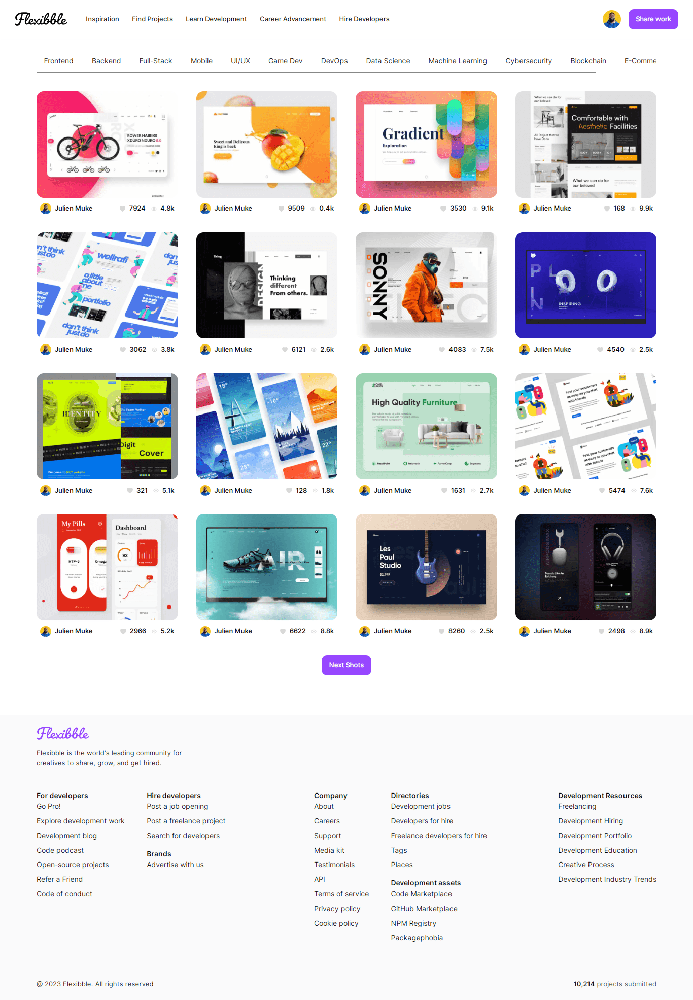

# Build and Deploy a Full Stack Next.js 13 Application | React, Next JS 13, TypeScript, Tailwind CSS

## Introduction
Flexibble is self-promotion and social networking platform for digital designers. It serves as a design portfolio platform, jobs and recruiting site and a platforms for designers to share their work online.

## Features:
- Use Next.js 13 App Router and Server side Rendering
- Implement Filtering Functionality
- Complete Pagination Capabilities
- Handle image uploads
- Understanding and writing proper TypeScript
- Learn Grafbase - a serverless GraphQL platform

## Learn from JavaScript Mastery 
⭐ JSM - https://jsmastery.pro/masterclass

